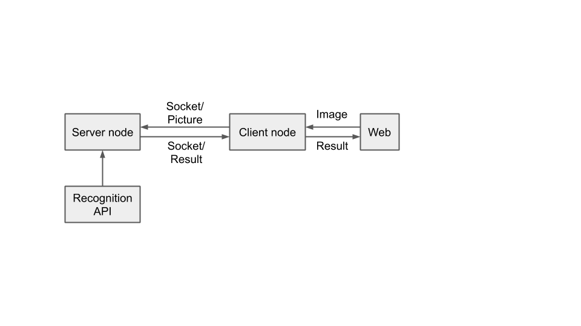
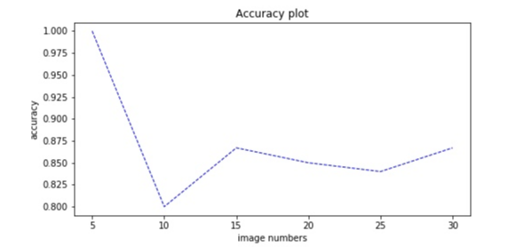
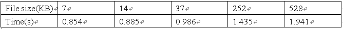
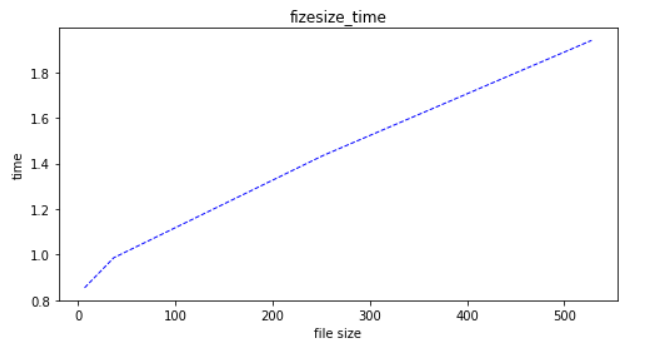
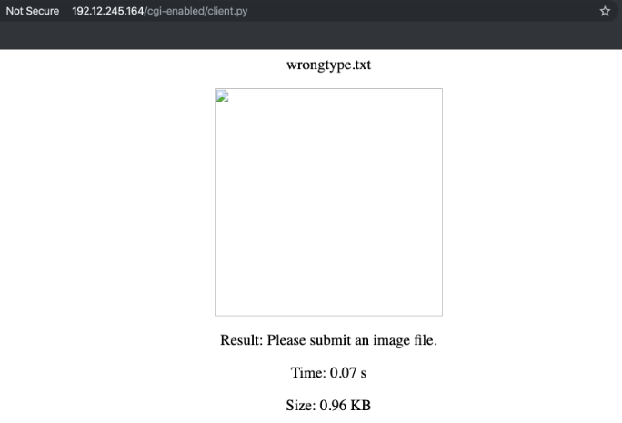

# Image-Recognition-Application
> Wei Jiang, Kaihong Wang, Ruikang Wang, Nianyi Zhang

This is a BU CS655 project.

In this project, we need to implement an image-recognition program that runs on two nodes separately. One of the nodes should take care of the image submitted from a client and query the other node which provides an interface that could be used to recognize an image and return the result.

## Experimental Methodology 
Since our system mainly consists of three modules, we introduce the technical details of them separately: 
### Client node
The task of the client node is to accept the image uploaded by a user and transmit it to the server node. We first need to catch the uploaded image using an HTML file at the client node. Then we use CGI to call the function that sends the image to the server node using a socket when the recognition process is triggered on the webpage. Finally, the client node will wait for the result of image recognition from the server node and shows it on the webpage.
### Server node
The server node keeps listening from the client node to establish communication using socket programming. Once retrieving an image from the client node, we utilize the image recognition API to process and categorize corresponding images. In the end, the recognition result will be sent back to the client node.
### Image recognition API 
The image recognition API will be called when the server node receives the image. After the image is passed in, the API preprocess the image in an appropriate way and input it into a pretrained GoogleNet model implemented using PyTorch. Finally, the recognition result vector will be output at the end of the model, converted into the corresponding class name and passed back to the program that called this API. 
### Architecture

## Results
### Usage Instructions 
Before using the application, you should make sure reserve two nodes whose version should be Ubuntu 18.04 or higher and the configuration file runs correctly on each node:

Server node: use /backend/server_node.rspec to reserve resources on the virtual machine and use /backend/server_node.sh to configure the required environment. In this case, we should have python3.6 and PyTorch, torchvision, PIL/pillow installed. Then the script will self-run the image_server.py which runs as a server program.

Client node: use /frontend/client_node.rspec to reserve resources on the virtual machine and use /frontend/client_node.sh to configure the required environment and code. In this case, we are using the 192.12.245.164 and have Apache2 deployed and put the upload.html and client.py on the client node. In addition, please update the IP address in upload.html and client.py.

### Analysis 
#### Accuracy rate
We download many random images from the Internet including cars, animals, clothes, food and so on. And we calculate the accuracy rate as the amount of the images goes up. We produce a figure that shows the average accuracy rate as a function of the number of images we test.

#### Image File Size vs. Total response time
We test our system with different size of image files and record the time it uses. Then we draw the figure that shows the average time as a function of the image file size. 

#### Exception Handling
Our system is designed to detect and recognize images. We want to test whether our system can handle exceptions correctly. For example, what if we upload a txt or doc file? 

### Conclusion
In this project, we successfully developed an image-recognition system deployed on two nodes and we also learned techniques about the interaction between HTML and Python, communication between nodes using socket programming as well as deep learning applied in image recognition area. In the future, we can upgrade our system so that it can take multiple recognition tasks in parallel. 
